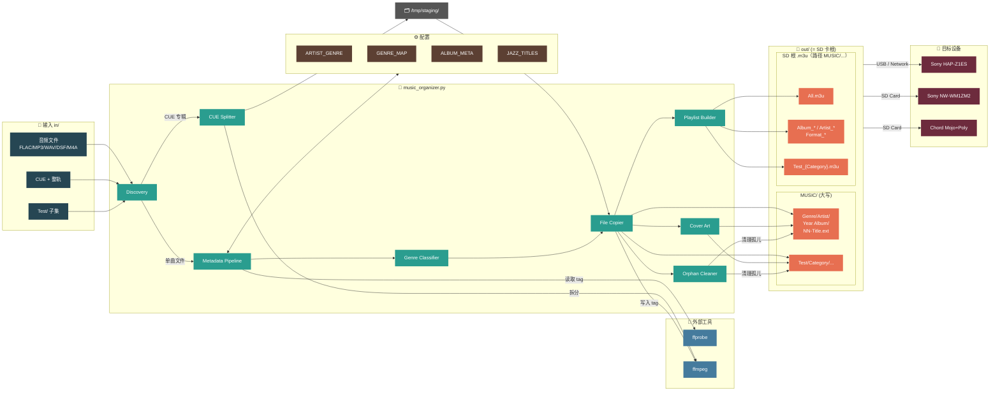
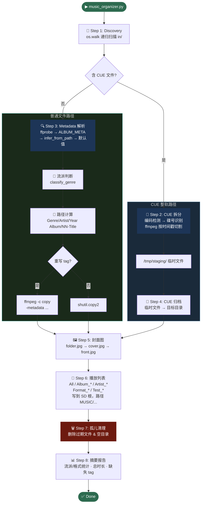
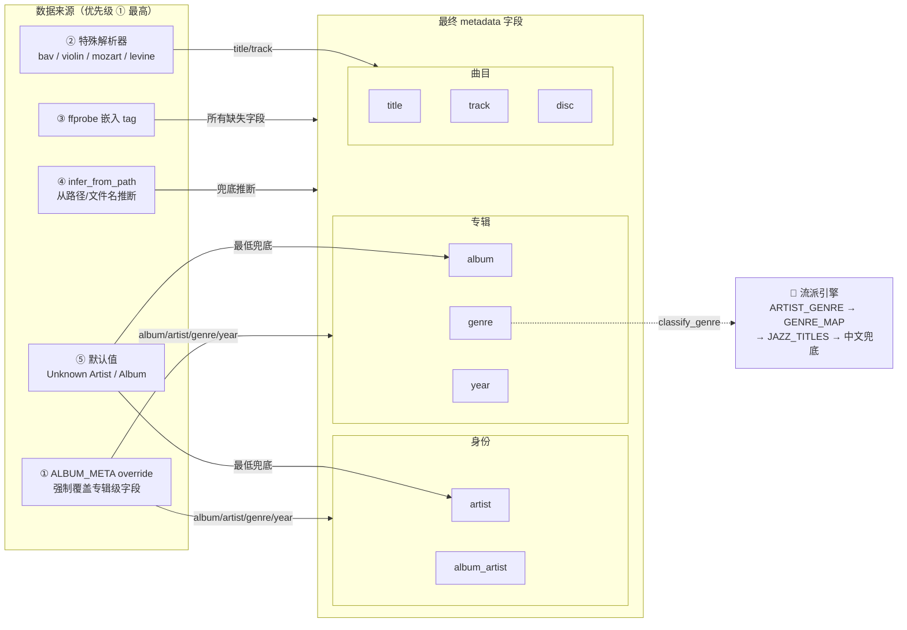

# Music Organizer — 设计图

## 1. 整体架构图（High-Level Design）

```mermaid
flowchart LR
    subgraph INPUT["📂 输入 in/"]
        A1["音频文件\nFLAC/MP3/WAV/DSF/M4A"]
        A2["CUE + 整轨"]
        A3["Test/ 子集"]
    end

    subgraph CONFIG["⚙️ 配置"]
        C1[ARTIST_GENRE]
        C2[GENRE_MAP]
        C3[ALBUM_META]
        C4[JAZZ_TITLES]
    end

    subgraph TOOLS["🔧 外部工具"]
        T1[ffprobe]
        T2[ffmpeg]
    end

    subgraph CORE["🐍 music_organizer.py"]
        P1[Discovery]
        P2[CUE Splitter]
        P3[Metadata Pipeline]
        P4[Genre Classifier]
        P5[File Copier]
        P6[Cover Art]
        P7[Playlist Builder]
        P8[Orphan Cleaner]
    end

    STAG["🗂 /tmp/staging/"]

    subgraph OUTPUT["📁 out/ (= SD 卡根)"]
        subgraph MUSIC["MUSIC/ (大写)"]
            O1["Genre/Artist/\nYear Album/\nNN-Title.ext"]
            O2["Test/Category/..."]
        end
        subgraph PLAYLISTS["SD 根 .m3u（路径 MUSIC/...）"]
            O3[All.m3u]
            O4["Album_* / Artist_*\nFormat_*"]
            O5["Test_{Category}.m3u"]
        end
    end

    subgraph DEVICES["🎵 目标设备"]
        D1[Sony HAP-Z1ES]
        D2[Sony NW-WM1ZM2]
        D3[Chord Mojo+Poly]
    end

    A1 & A2 & A3 --> P1
    P1 -->|CUE 专辑| P2
    P1 -->|单曲文件| P3
    P2 -->|拆分| T2
    P2 -->|临时文件| STAG --> P5
    P3 -->|读取 tag| T1
    P3 <--> CONFIG
    P3 --> P4 --> P5
    P5 -->|写入 tag| T2
    P5 --> O1 & O2
    P5 --> P6 --> O1 & O2
    P5 --> P7 --> O3 & O4 & O5
    P5 --> P8 -->|清理孤儿| O1 & O2
    OUTPUT -->|USB / Network| D1
    OUTPUT -->|SD Card| D2 & D3

    classDef input fill:#264653,color:#fff,stroke:none
    classDef core fill:#2a9d8f,color:#fff,stroke:none
    classDef tool fill:#457b9d,color:#fff,stroke:none
    classDef staging fill:#555,color:#fff,stroke:none
    classDef output fill:#e76f51,color:#fff,stroke:none
    classDef device fill:#6d2b3d,color:#fff,stroke:none
    classDef config fill:#5c4033,color:#fff,stroke:none

    class A1,A2,A3 input
    class P1,P2,P3,P4,P5,P6,P7,P8 core
    class T1,T2 tool
    class STAG staging
    class O1,O2,O3,O4,O5 output
    class D1,D2,D3 device
    class C1,C2,C3,C4 config
```

---

## 2. 工作流程图（Workflow）

```mermaid
flowchart TD
    START([▶ music_organizer.py]) --> S1

    S1["📂 Step 1: Discovery\nos.walk 递归扫描 in/"]
    S1 --> DET{含 CUE 文件?}

    subgraph CUE_PATH["CUE 整轨路径"]
        S2["📀 Step 2: CUE 拆分\n编码检测 → 碟号识别\nffmpeg 按时间戳切割"]
        STAG["/tmp/staging/ 临时文件"]
        S4["📁 Step 4: CUE 归档\n临时文件 → 目标目录"]
        S2 --> STAG --> S4
    end

    subgraph REG_PATH["普通文件路径"]
        S3["🔍 Step 3: Metadata 解析\nffprobe → ALBUM_META\n→ infer_from_path → 默认值"]
        GENRE["🎵 流派判断\nclassify_genre"]
        PATH["📁 路径计算\nGenre/Artist/Year Album/NN-Title"]
        COPY{重写 tag?}
        FFCOPY["ffmpeg -c copy\n-metadata ..."]
        SHCOPY["shutil.copy2"]
        S3 --> GENRE --> PATH --> COPY
        COPY -->|是| FFCOPY
        COPY -->|否| SHCOPY
    end

    DET -->|是| S2
    DET -->|否| S3

    FFCOPY & SHCOPY & S4 --> S5

    S5["🖼 Step 5: 封面图\nfolder.jpg → cover.jpg → front.jpg"]
    S5 --> S6["🎵 Step 6: 播放列表\nAll / Album_* / Artist_*\nFormat_* / Test_*\n写到 SD 根，路径 MUSIC/..."]
    S6 --> S7["🗑 Step 7: 孤儿清理\n删除过期文件 & 空目录"]
    S7 --> S8["📊 Step 8: 摘要报告\n流派/格式统计 · 总时长 · 缺失 tag"]
    S8 --> END([✅ Done])

    style START fill:#2d6a4f,color:#fff,stroke:none
    style END fill:#2d6a4f,color:#fff,stroke:none
    style S2 fill:#1d3557,color:#fff,stroke:none
    style S3 fill:#1d3557,color:#fff,stroke:none
    style S7 fill:#6d1a0f,color:#fff,stroke:none
    style CUE_PATH fill:#1a2a3a,color:#ccc,stroke:#457b9d
    style REG_PATH fill:#1a2a1a,color:#ccc,stroke:#2a9d8f
```

---

## 3. Metadata 解析优先级图

```mermaid
flowchart LR
    subgraph SOURCES["数据来源（优先级 ① 最高）"]
        direction TB
        V1["① ALBUM_META override\n强制覆盖专辑级字段"]
        V2["② 特殊解析器\nbav / violin / mozart / levine"]
        V3["③ ffprobe 嵌入 tag"]
        V4["④ infer_from_path\n从路径/文件名推断"]
        V5["⑤ 默认值\nUnknown Artist / Album"]
    end

    subgraph FIELDS["最终 metadata 字段"]
        direction TB
        subgraph ID["身份"]
            F2[artist]
            F3[album_artist]
        end
        subgraph ALBUM["专辑"]
            F4[album]
            F5[genre]
            F6[year]
        end
        subgraph TRACK["曲目"]
            F1[title]
            F7[track]
            F8[disc]
        end
    end

    GENRE_ENGINE["🎵 流派引擎\nARTIST_GENRE → GENRE_MAP\n→ JAZZ_TITLES → 中文兜底"]

    V1 -->|album/artist/genre/year| ALBUM & ID
    V2 -->|title/track| TRACK
    V3 -->|所有缺失字段| FIELDS
    V4 -->|兜底推断| FIELDS
    V5 -->|最低兜底| F2 & F4
    F5 -.->|classify_genre| GENRE_ENGINE
```
